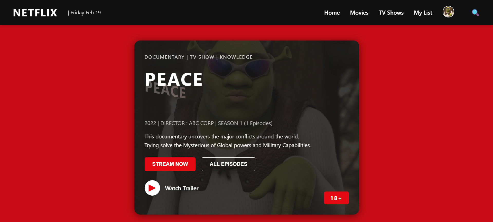

# NetFlix_Clone
## Date:- 10-07-2025
## Objective:
To create a modern, responsive navigation bar using CSS Flexbox, mimicking real-world websites like Netflix. This helps reinforce alignment, spacing, and layout structuring using Flexbox properties.

## Tasks:

#### 1. Structure the HTML Layout:
Use a ```<nav>``` tag as the main container.

Add a brand logo/title on the left using a ```<div> or <h1>```.

Add navigation links like Home, Menu, About, Contact, and Login using a ```<ul> with <li> and <a>```.

#### 2. Apply Flexbox for Layout:
Use display: flex on the ```<nav>``` container.

Use justify-content: space-between to align the logo and menu.

Use align-items: center to vertically center both sections.

Style list items with horizontal spacing using gap or margin.

#### 3. Style Like a Real-World Navbar:
Add background color (e.g., dark or gradient like Netflix/Zomato).

Style text with bold fonts, hover effects, and link styling.

Remove default ul and li styles (list-style: none, text-decoration: none).

#### 4. Bonus Enhancements:
Add a hover underline or button effect on links.

Make it responsive using flex-wrap or media queries.

Fix the nav bar to top with position: sticky.
## HTML Code:
```html
<!DOCTYPE html>
<html lang="en">
<head>
  <meta charset="UTF-8">
  <meta name="viewport" content="width=device-width, initial-scale=1.0">
  <title>Netflix Documentary - Peace</title>
  <link rel="stylesheet" href="style.css">
</head>
<body>
  <div class="background"></div>
  <header class="navbar">
    <div class="navbar-left">
      <span class="logo">NETFLIX</span>
      <span class="date">| Friday Feb 19</span>
    </div>
    <nav class="navbar-right">
      <a href="#">Home</a>
      <a href="#">Movies</a>
      <a href="#">TV Shows</a>
      <a href="#">My List</a>
      <div class="profile">
        
      </div>
      <span class="search">&#128269;</span>
    </nav>
  </header>

  <main>
    <section class="main-content">
      <div class="category">
        DOCUMENTARY | TV SHOW | KNOWLEDGE
      </div>
      <h1 class="title">PEACE</h1>
      <div class="peace-shadow">PEACE</div>
      <div class="details">
        2022 | DIRECTOR : ABC CORP | SEASON 1 (1 Episodes)
      </div>
      <p class="description">
        This documentary uncovers the major conflicts around the world.<br>
        Trying solve the Mysterious of Global powers and Military Capabilities.
      </p>
      <div class="actions">
        <button class="stream-btn">STREAM NOW</button>
        <button class="all-episodes-btn">ALL EPISODES</button>
      </div>
      <div class="trailer">
        <button class="trailer-btn">&#9658;</button>
        <span>Watch Trailer</span>
      </div>
      <div class="age-restriction">18+</div>
    </section>
  </main>
</body>
</html>
```
## CSS Code:
```css
* {
  margin: 0;
  padding: 0;
  box-sizing: border-box;
}

body, html {
  height: 100%;
  font-family: 'Segoe UI', Arial, sans-serif;
  background: #181818;
  color: #fff;
  position: relative;
  min-height: 100vh;
}

.background {
  position: fixed;
  top: 0; left: 0; right: 0; bottom: 0;
  background: #e50914;
  z-index: 0;
  opacity: 0.85;
}

.navbar {
  position: relative;
  z-index: 2;
  display: flex;
  justify-content: space-between;
  align-items: center;
  background: #111;
  padding: 1.2rem 2.5rem 1.2rem 2.5rem;
  box-shadow: 0 2px 8px rgba(0,0,0,0.2);
}

.navbar-left {
  display: flex;
  align-items: center;
  gap: 1rem;
}

.logo {
  font-size: 2rem;
  font-weight: bold;
  color: #fff;
  letter-spacing: 2px;
}

.date {
  color: #ccc;
  font-size: 1rem;
  margin-left: 1rem;
}

.navbar-right {
  display: flex;
  align-items: center;
  gap: 2rem;
}

.navbar-right a {
  color: #fff;
  text-decoration: none;
  font-weight: 500;
  font-size: 1.1rem;
  padding: 6px 0;
  transition: color 0.2s;
  position: relative;
}

.navbar-right a:hover {
  color: #e50914;
}

.profile img {
  width: 36px;
  height: 36px;
  border-radius: 50%;
  border: 2px solid #fff;
  object-fit: cover;
}

.search {
  font-size: 1.4rem;
  margin-left: 1.2rem;
  cursor: pointer;
}

.main-content {
  position: relative;
  z-index: 2;
  max-width: 700px;
  margin: 3rem auto 2rem auto;
  padding: 2.5rem 2rem 2.5rem 2rem;
  border-radius: 18px;
  box-shadow: 0 4px 24px rgba(0,0,0,0.5);
  text-align: left;
  /* Background image with overlay */
  background: 
    linear-gradient(rgba(24,24,24,0.85), rgba(24,24,24,0.85)),
    url('https://i.pinimg.com/736x/b8/5f/3a/b85f3a28fd572685b0dab45537113294.jpg') center center/cover no-repeat;
}

.category {
  color: #fff;
  font-size: 0.95rem;
  letter-spacing: 1.5px;
  margin-bottom: 1.2rem;
  opacity: 0.8;
}

.title {
  font-size: 3.5rem;
  font-weight: bold;
  letter-spacing: 3px;
  margin-bottom: 0.8rem;
  color: #fff;
}

.peace-shadow {
  font-size: 2.5rem;
  font-weight: bold;
  letter-spacing: 2px;
  color: transparent;
  background: linear-gradient(90deg, #fff 0%, #e50914 100%);
  background-clip: text;
  -webkit-background-clip: text;
  opacity: 0.3;
  margin-bottom: 1.5rem;
  transform: skewY(10deg) scaleY(1.2);
  user-select: none;
}

.details {
  color: #bbb;
  font-size: 1.05rem;
  margin-bottom: 1.1rem;
}

.description {
  color: #eee;
  font-size: 1.05rem;
  margin-bottom: 1.6rem;
  line-height: 1.6;
}

.actions {
  display: flex;
  gap: 1.2rem;
  margin-bottom: 1.8rem;
}

.stream-btn,
.all-episodes-btn {
  padding: 0.7rem 1.5rem;
  border: none;
  border-radius: 4px;
  font-size: 1rem;
  font-weight: 600;
  cursor: pointer;
  transition: background 0.2s, color 0.2s;
}

.stream-btn {
  background: #e50914;
  color: #fff;
}

.stream-btn:hover {
  background: #b0060f;
}

.all-episodes-btn {
  background: transparent;
  color: #fff;
  border: 1.5px solid #fff;
}

.all-episodes-btn:hover {
  background: #fff;
  color: #e50914;
}

.trailer {
  display: flex;
  align-items: center;
  gap: 1rem;
  margin-bottom: 1.2rem;
}

.trailer-btn {
  background: #fff;
  color: #e50914;
  border: none;
  border-radius: 50%;
  width: 48px;
  height: 48px;
  font-size: 2rem;
  display: flex;
  align-items: center;
  justify-content: center;
  cursor: pointer;
  box-shadow: 0 2px 8px rgba(0,0,0,0.2);
  transition: background 0.2s;
}

.trailer-btn:hover {
  background: #e50914;
  color: #fff;
}

.trailer span {
  color: #fff;
  font-size: 1.1rem;
  font-weight: 500;
}

.age-restriction {
  position: absolute;
  right: 2rem;
  bottom: 2rem;
  background: #e50914;
  color: #fff;
  padding: 0.5rem 1.2rem;
  font-size: 1.1rem;
  font-weight: bold;
  border-radius: 6px;
  letter-spacing: 2px;
}
.popular {
  position: relative;
  z-index: 2;
  max-width: 900px;
  margin: 0 auto 2rem auto;
  padding: 2rem 1.5rem;
  background: rgba(20,20,20,0.85);
  border-radius: 16px;
  box-shadow: 0 2px 12px rgba(0,0,0,0.25);
}

.popular h2 {
  font-size: 1.3rem;
  font-weight: 600;
  color: #fff;
  margin-bottom: 1.2rem;
  letter-spacing: 1px;
}

.popular-list {
  display: flex;
  gap: 2rem;
  flex-wrap: wrap;
}

.show-card {
  display: flex;
  flex-direction: column;
  align-items: center;
  gap: 0.5rem;
  background: #222;
  padding: 1rem 1.2rem;
  border-radius: 10px;
  min-width: 90px;
  box-shadow: 0 1px 6px rgba(0,0,0,0.15);
  transition: transform 0.2s;
}

.show-card:hover {
  transform: translateY(-6px) scale(1.05);
}

.show-card img {
  width: 80px;
  height: 80px;
  object-fit: cover;
  border-radius: 8px;
  margin-bottom: 0.5rem;
}

.show-card span {
  color: #fff;
  font-size: 1rem;
  font-weight: 500;
  text-align: center;
}
```
## Output:

## Result:
A modern, responsive navigation bar using CSS Flexbox, mimicking real-world websites like Netflix. This helps reinforce alignment, spacing, and layout structuring using Flexbox properties is created successfully.
